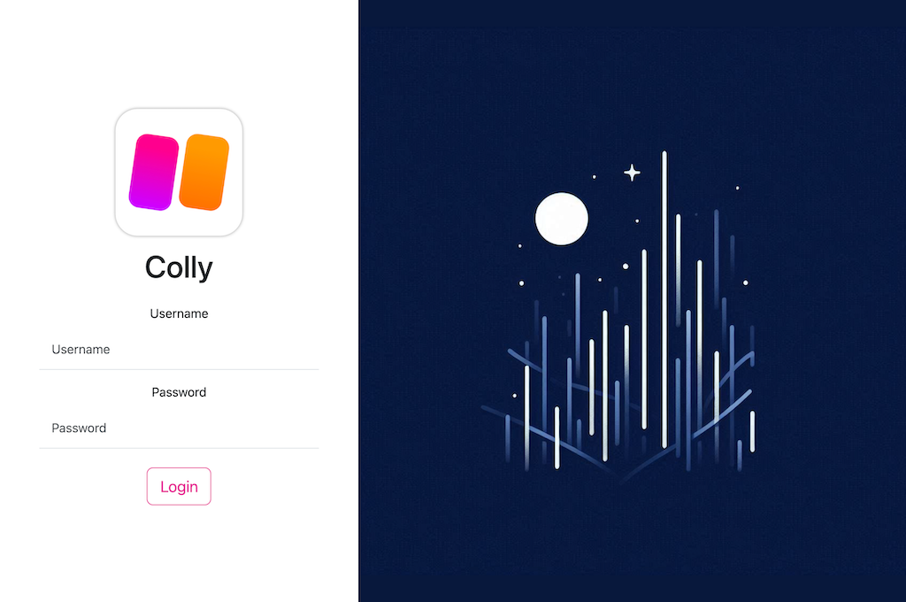
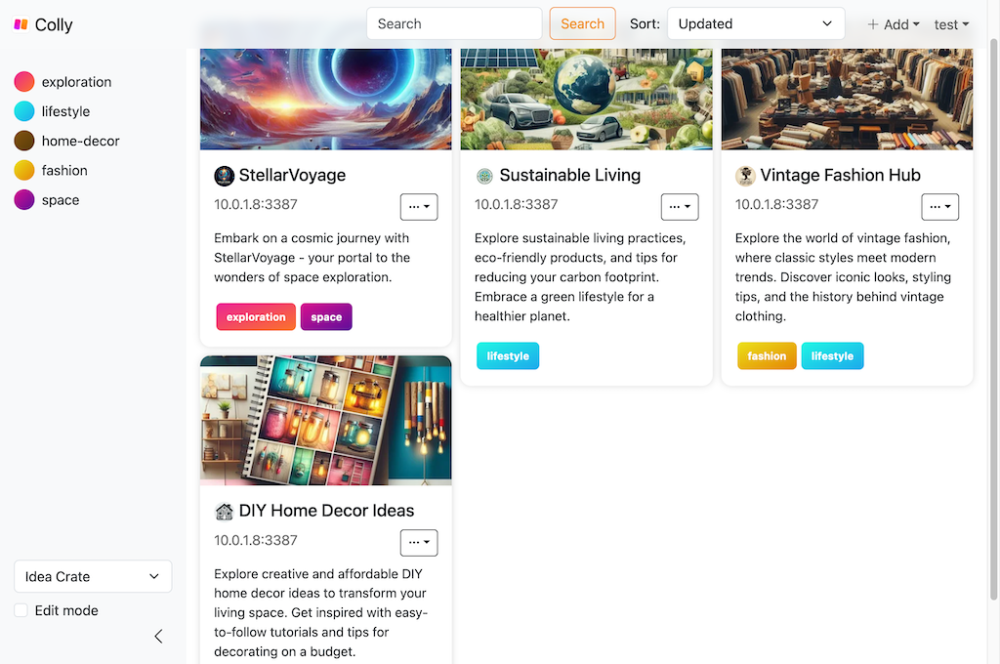
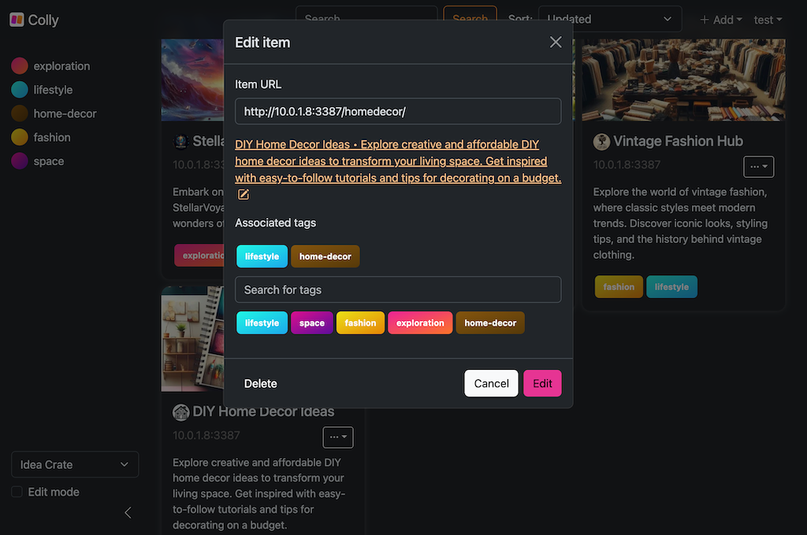

<p align="center">
    
</p>

<h1 align="center">Colly</h1>
<p align="center">Web-based Website URL Collection app</p>

<p align="center">
    <a href="https://github.com/jarne/colly/blob/main/package.json">
        
    </a>
    <a href="https://circleci.com/gh/jarne/colly">
        
    </a>
    <a href="https://github.com/jarne/colly/blob/main/LICENSE">
        
    </a>
</p>

## 📙 Description

Colly is a web-based application designed for effortlessly collecting and organizing your favorite URL's and websites.
With Colly, users can create a personalized library of web pages.

One of Colly's features is its tagging system, which allows users to categorize and organize their collections with ease.
Whether it's articles, blogs, tutorials, or any other web content, users can assign relevant tags to each link,
enabling efficient retrieval and navigation within their collections.

The collection of a user can also be set as public and accessed using a public access link by
anyone who has the link.

Whether you're a student, professional, or simply someone who loves to explore the web,
Colly empowers users to create curated collections tailored to their unique preferences and interests.
Say goodbye to scattered bookmarks and hello to a more organized, accessible, and enjoyable web browsing experience with Colly.

### Screenshots







## 🖥 Usage

### Docker Compose

The recommended way to deploy Colly is using Docker. There is a ready-to-use
example [Docker Compose file](./docker-compose.yml) available in this repository.

With [Docker installed](https://docs.docker.com/engine/install/), you can use the following
commands to clone the repository and run Toohga using Docker Compose.

First, clone the repository.

```sh
git clone https://github.com/jarne/colly.git
cd colly
```

Then copy the `.env` file template for Docker and replace the secret values in this file.

```sh
cp .env.docker.example .env
```

Start the services using Docker Compose.

```sh
sudo docker compose up
```

### Manual deployment

Alternative deployment methods are to use the [Docker](./Dockerfile) image or deploy the
Node.js application directly on the operating system.

When deploying without the Docker file, keep in mind to install Node.js and required dependencies using Yarn:

```
yarn install

cd client
yarn install
yarn run build
```

### Environment variables

The following environment variables need be set:

| Env variable          | Default Value | Description                                           |
| --------------------- | ------------- | ----------------------------------------------------- |
| `MONGO_HOST`          |               | Hostname of MongoDB                                   |
| `MONGO_PORT`          | `27017`       | Port of MongoDB                                       |
| `MONGO_DB`            |               | MongoDB database name                                 |
| `JWT_SECRET`          |               | Random secret for JWT                                 |
| `S3_ENDPOINT`         |               | Hostname for S3-compatible endpoint for image storage |
| `S3_REGION`           |               | S3 region to use                                      |
| `S3_ACCESS_KEY`       |               | Access key ID for S3 endpoint                         |
| `S3_ACCESS_SECRET`    |               | Secret access key for S3 endpoint                     |
| `S3_BUCKET`           |               | Name of the S3 bucket                                 |
| `S3_FORCE_PATH_STYLE` | `false`       | Force path style URLs for S3 objects                  |

In addition, the following _optional_ environment variables can be set:

| Env variable             | Default Value | Description                                                     |
| ------------------------ | ------------- | --------------------------------------------------------------- |
| `EXPIRES_IN_SEC`         | `86400`       | Expiration of JWT (in seconds)                                  |
| `INITIAL_ADMIN_USERNAME` |               | Create initial admin user with this username                    |
| `INITIAL_ADMIN_PASSWORD` |               | Password for initial admin user                                 |
| `LOG_LEVEL`              | `info`        | Log level of the app                                            |
| `LOKI_HOST`              |               | Hostname for Grafana Loki to send logs to                       |
| `LOKI_BASIC_AUTH`        |               | Authentication credentials (basic auth format) for Grafana Loki |

## ⌨️ Development

Colly is based on a back-end and front-end part.

### Back-end

The back-end of the application inside the main folder is written in JavaScript using Node.js and the Express framework.
As dependencies, a MongoDB database for storing the data and an S3-compatible object storage, such as MinIO, for storing
image meta data such as website icons and banners, are required.

Using the following command, the back-end can be started for development: `yarn run dev`

Unit tests inside the [test](./test) folder are using Mocha and Chai.
The following checks should be run before commiting code to execute unit tests, ESLint and format the code according
to the defined code style:

```sh
yarn run test
yarn run lint
yarn run format
```

#### Test data

There are several tool scripts and a test dataset for development and testing, placed in the [test-data](./test-data) folder.

Create first user: `yarn node userInit.js`  
Run web server to serve test websites: `yarn run dev:test-data`  
Insert test data into database: `yarn node insertTestData.js`

### Front-end

The front-end inside the `client` folder is written in JavaScript and is based on React, Vite and Bootstrap for styles.

Run development server: `yarn run dev`  
Create build: `yarn run build`  
Run ESLint: `yarn run lint`

Code style formatting is configured in the parent folder, so if you run `yarn run format` in the main folder,
it will format both the back-end and front-end.

## 🙋‍ Contribution

Contributions are always very welcome! It's completely equal if you're a beginner or a more experienced developer.

Thanks for your interest 🎉👍!

## 👨‍⚖️ License

[MIT](https://github.com/jarne/colly/blob/main/LICENSE)
